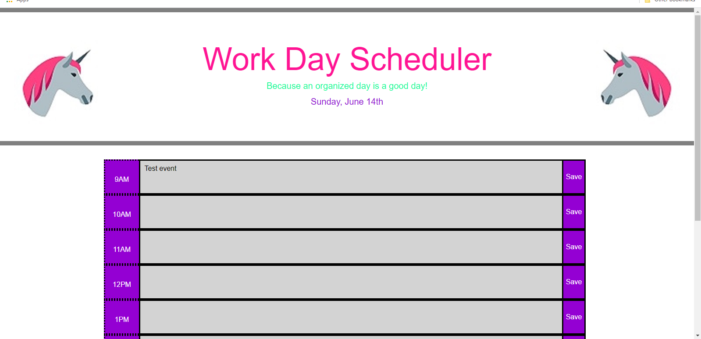

# Work Day Scheduler

## Description

I have created a work day planner that is updated using momentjs. The planner saves events in local storage so that they can be accessed even after closing the browser tab. The user will enter an event for a specific time slot and click the Save button. Events can be overwritten as needed. During the work day, the time slots will be color coded to show whether events are past, future, or currently taking place at a glance. The day and date will be automatically updated.

<https://melindawinter.github.io/work-day-scheduler/>

## Credits

Thank you to my boot camp instructor, Joe Tanksley, and TA, Adam Abundis and my tutor Thor Nolan, who helped me learn how to use momentjs. Thank you to Jeanette Hernandez, Kate An, Cyrus Jose, and Kevin Cabe who all collaborated with me during different points in the project and shared their ideas and projects as well.

## License

I chose a permissive GNU license for this project, so that others can use and modify the code for their own purposes, but the source code cannot become proprietary and changes must be documented. The file name is COPYING as per GNU convention.
